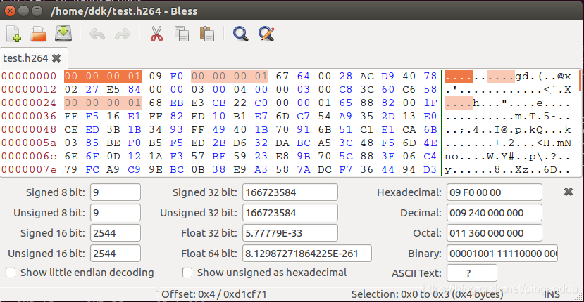

# 【GStreamer】meson编译gstreamer-1.21.2

[https://blog.csdn.net/u010168781/article/details/129201003](https://blog.csdn.net/u010168781/article/details/129201003)

# 1、安装编译工具meson

## 1.1 版本要求：

[gstreamer](https://so.csdn.net/so/search?q=gstreamer&spm=1001.2101.3001.7020)-1.21.2的版本编译要求meson的版本>= 0.62；否则编译时报错

```
meson.build:1:0: ERROR: Meson version is 0.61.5 but project requires >= 0.62
```

更低的版本（Version: 0.45.1，默认使用命令安装meson，sudo apt install meson）则会报错：

```
meson.build:664:56: ERROR: lexer
```

meson-0.62的版本要求python版本>=3.7

```
NOTICE: You are using Python 3.6 which is EOL. Starting with v0.62.0, Meson will require Python 3.7 or new
```

## 1.2 安装高版本的meson

pip国内镜像

```
阿里云 http://mirrors.aliyun.com/pypi/simple/
中国科技大学 https://pypi.mirrors.ustc.edu.cn/simple/
豆瓣(douban) http://pypi.douban.com/simple/
清华大学 https://pypi.tuna.tsinghua.edu.cn/simple/
中国科学技术大学 http://pypi.mirrors.ustc.edu.cn/simple/
```

更新国内源，修改 ~/.pip/pip.conf (没有就创建一个)， 内容如下

```jsx
[global]
index-url = [https://pypi.tuna.tsinghua.edu.cn/simple](https://pypi.tuna.tsinghua.edu.cn/simple)
```

安装meson:

```
sudo apt install python3-pip
python3 -m pip install meson==0.64.1
```

建议使用国内镜像，例如:

```
pip install -i <https://pypi.tuna.tsinghua.edu.cn/simple> meson==0.62.2
```

meson默认安装路径：

```
~/.local/bin/meson
```

### 文章目录

- [1 编译依赖](https://blog.csdn.net/pinganddu/article/details/102717816#1__1)[1.1 先编glib的依赖](https://blog.csdn.net/pinganddu/article/details/102717816#11_glib_4)[1.1.1 libffi](https://blog.csdn.net/pinganddu/article/details/102717816#111_libffi_5)[1.1.2 zlib](https://blog.csdn.net/pinganddu/article/details/102717816#112_zlib_17)[1.1.3 elfutils](https://blog.csdn.net/pinganddu/article/details/102717816#113_elfutils_29) [1.2 编译glib](https://blog.csdn.net/pinganddu/article/details/102717816#12_glib_40)[1.2.1 编写交叉编译文件](https://blog.csdn.net/pinganddu/article/details/102717816#121__43)[1.2.2 编译步骤](https://blog.csdn.net/pinganddu/article/details/102717816#122__61)  [2 编译gstreamer](https://blog.csdn.net/pinganddu/article/details/102717816#2_gstreamer_94)[2.1 gstreamer](https://blog.csdn.net/pinganddu/article/details/102717816#21_gstreamer_96)[2.1.1 设置环境](https://blog.csdn.net/pinganddu/article/details/102717816#211__97)[2.2.1 开始编译:](https://blog.csdn.net/pinganddu/article/details/102717816#221__131) [2.2 gst-plugins-base](https://blog.csdn.net/pinganddu/article/details/102717816#22_gstpluginsbase_143)[2.3 gst-plugins-good](https://blog.csdn.net/pinganddu/article/details/102717816#23_gstpluginsgood_160)[2.4 gst-plugins-bad](https://blog.csdn.net/pinganddu/article/details/102717816#24_gstpluginsbad_188) [3 板子上运行](https://blog.csdn.net/pinganddu/article/details/102717816#3__209)

## 1 编译依赖

首先依赖关系如下:[gstreamer](https://so.csdn.net/so/search?q=gstreamer&spm=1001.2101.3001.7020) -> glib -> libffi zlib elfutils

### 1.1 先编glib的依赖

### 1.1.1 libffi

[libffi3.2.1下载地址](https://sourceware.org/ftp/libffi/libffi-3.2.1.tar.gz)

```
./configure \
--prefix=/home/ddk/gstreamer/new-root/usr \
--host=aarch64-himix100-linux \
--enable-shared \
--enable-static

make && make install
1234567
```

### 1.1.2 [zlib](https://so.csdn.net/so/search?q=zlib&spm=1001.2101.3001.7020)

[zlib1.2.11下载地址](http://prdownloads.sourceforge.net/libpng/zlib-1.2.11.tar.gz?download)

```
CHOST=aarch64-himix100-linux \
./configure \
--prefix=/home/ddk/gstreamer/new-root/usr \
--static \
--shared

make && make install
1234567
```

### 1.1.3 elfutils

[elfutils 0.177](https://sourceware.org/elfutils/ftp/elfutils-latest.tar.bz2)
 elfutils 会用到上面编译好的zlib

```
LDFLAGS="-L/home/ddk/gstreamer/new-root/usr/lib" \
CFLAGS="-I/home/ddk/gstreamer/new-root/usr/include" \
LIBS="-lz" \
./configure \
--prefix=/home/ddk/gstreamer/new-root/usr \
--host=aarch64-himix100-linux
123456
```

### 1.2 编译glib

[glib 2.63.0下载地址](https://ftp.gnome.org/pub/gnome/sources/glib/2.63/glib-2.63.0.tar.xz)
 glib转向meson编译系统, [交叉编译](https://so.csdn.net/so/search?q=%E4%BA%A4%E5%8F%89%E7%BC%96%E8%AF%91&spm=1001.2101.3001.7020)需要手写一个配置文件: aarch64-linux (名字随便起)

### 1.2.1 编写交叉编译文件

```
[paths]
prefix = '/home/ddk/gstreamer/new-root/usr'

[binaries]
c = '/opt/hisi-linux/x86-arm/aarch64-himix100-linux/bin/aarch64-himix100-linux-gcc'
cpp = '/opt/hisi-linux/x86-arm/aarch64-himix100-linux/bin/aarch64-himix100-linux-g++'
ar = '/opt/hisi-linux/x86-arm/aarch64-himix100-linux/bin/aarch64-himix100-linux-ar'
strip = '/opt/hisi-linux/x86-arm/aarch64-himix100-linux/bin/aarch64-himix100-linux-strip'
pkgconfig = '/usr/bin/pkg-config'

[host_machine]
system = 'linux'
cpu_family = 'aarch64'
cpu = 'aarch64'
endian = 'little'
123456789101112131415
```

### 1.2.2 编译步骤

meson系统使用多种方法来搜索依赖, 前面编译的libffi, zlib, elfutils是通过pkg-config来找到的,因此还需要配置pkg-config

```
export PKG_CONFIG_LIBDIR=/home/ddk/gstreamer/new-root/usr/lib/pkgconfig
1
```

**为啥不设置PKG_CONFIG_SYSROOT_DIR, PKG_CONFIG_PATH ?**
 PKG_CONFIG_LIBDIR:
 表示不搜索系统默认的/usr/lib/pkgconfig和/usr/share/pkgconfig, 搜索指定的目录
 PKG_CONFIG_SYSROOT_DIR:
 表示修改-I和-L后面的路径, 修改方式是在路径前加上target的sysroot路径, 例如:

```
export PKG_CONFIG_SYSROOT_DIR=/path-to-target
pkg-config --libs --cflags foo.pc
-I/path-to-target/原来的
123
```

PKG_CONFIG_PATH:
 表示除了搜索默认的系统路径, 还要搜索该变量里指定的目录.

```
meson \
--cross-file aarch64-linux \
-Dinternal_pcre=true \
-Dselinux=false \
-Dinstalled_tests=false \
-Ddtrace=false \
-Dfam=false \
-Dsystemtap=false \
-Dselinux=disabled \
-Dlibmount=false build/

cd build
ninja && ninja install
12345678910111213
```

## 2 编译gstreamer

[gstreamer和所有插件下载地址](https://gstreamer.freedesktop.org/src/)

### 2.1 gstreamer

### 2.1.1 设置环境

gstreamer也是使用meson, 因此要确保依赖搜索正确. 我们在编译的时候可能会打开多个终端, 因此需要确保环境设置正确.

```
echo $PKG_CONFIG_LIBDIR
1
```

如果没有结果的话, 则设置

```
export PKG_CONFIG_LIBDIR=/home/ddk/gstreamer/new-root/usr/lib/pkgconfig
1
```

更改meson.build文件:
 对于文件中的大变量LIBDIR等,包含prefix,我们需要将prefix改为’/usr’,否则在target上,gst-launch找不到library,因为prefix是我们编译机器上的路径.

不更改会这样:

```
0:00:00.006149600 10269       0x42a800 INFO                GST_INIT gst.c:586:init_pre: Initializing GStreamer Core Library version 1.16.1
0:00:00.006349900 10269       0x42a800 INFO                GST_INIT gst.c:587:init_pre: Using library installed in /home/ddk/gstreamer/new-root/usr/lib
0:00:00.006389600 10269       0x42a800 INFO                GST_INIT gst.c:607:init_pre: Linux (none) 4.9.37 #1 SMP Wed Jul 31 19:57:09 CST 2019 aarch64
0:00:00.006616180 10269       0x42a800 INFO                GST_INIT gst.c:500:add_path_func: Adding plugin path: "/usr/lib", will scan later
0:00:00.007505620 10269       0x42a800 INFO                GST_INIT gstmessage.c:128:_priv_gst_message_initialize: init messages
0:00:00.008638820 10269       0x42a800 INFO                GST_INIT gstcontext.c:84:_priv_gst_context_initialize: init contexts
123456
```

系统在运行的时候找不到插件库.

另外之前编译libffi的时候,库安装到…/usr/lib64下了, 拷贝到…/usr/lib目录下. 注意不是移动, 是拷贝! 因为libffi 的 pkg-config文件还是用…/usr/lib64下的库.

不拷贝会这样:

```
libgobject-2.0.so: undefined reference to `ffi_type_void'
1
```

### 2.2.1 开始编译:

```
meson \
--cross-file aarch64-linux \
-Dgtk_doc=disabled \
-Dtests=disabled \
-Dexamples=disabled build/

cd build
ninja && ninja install
12345678
```

### 2.2 gst-plugins-base

前面环境设置好, gstreamer插件只需要编译就好了.

```
meson \
--cross-file aarch64-linux \
-Dgtk_doc=disabled \
-Dalsa=disabled \
-Dx11=disabled \
-Dpango=disabled \
-Dtests=disabled \
-Dexamples=disabled \
-Dorc=disabled build

cd build
ninja && ninja install
123456789101112
```

### 2.3 gst-plugins-good

```
meson \
--cross-file aarch64-linux \
-Dtests=disabled \
-Dexamples=disabled \
-Dximagesrc=disabled \
-Dcairo=disabled \
-Djpeg=disabled \
-Dpng=disabled \
-Dpulse=disabled \
-Dgdk-pixbuf=disabled \
-Daudiofx=disabled \
-Ddeinterlace=disabled \
-Dgoom=disabled \
-Dgoom2k1=disabled \
-Dvideobox=disabled \
-Doss=disabled \
-Doss4=disabled \
-Dvideomixer=disabled \
-Dorc=disabled \
-Dgtk3=disabled \
-Dsoup=disabled build/
123456789101112131415161718192021
```

为啥要禁这么多?
 因为每一项都对应一个package的依赖, 需要手动编译这个依赖, 因此在板子上, 我只编我需要的.

### 2.4 gst-plugins-bad

bad插件的依赖就更多了, 在bad插件中, 我只需要codecparsers这个功能里的h264parse element,因此其他手动在meson.build文件中注释掉, 例如, 在文件gst-libs/gst/meson.build中:

```
#subdir('uridownloader')
#subdir('adaptivedemux')
#subdir('audio')
#subdir('basecamerabinsrc')
subdir('codecparsers')
#subdir('insertbin')
#subdir('interfaces')
#subdir('isoff')
#subdir('mpegts')
#subdir('opencv')
#subdir('player')
#subdir('sctp')
#subdir('wayland')
#subdir('webrtc')
1234567891011121314
```

其他目录也如此, 需要哪个, 打开哪个.

## 3 板子上运行

将上面生成的可执行文件, 库, 头文件, 配置文件全部拷贝到海思的板子上.

```
gst-launch-1.0 -v fakesrc num-buffers=5 ! fakesink
1
```

运行结果如下:

```
Setting pipeline to PAUSED ...
Pipeline is PREROLLING ...
Pipeline is PREROLLED ...
Setting pipeline to PLAYING ...
New clock: GstSystemClock
Got EOS from element "pipeline0".
Execution ended after 0:00:00.004000020
Setting pipeline to PAUSED ...
Setting pipeline to READY ...
Setting pipeline to NULL ...
Freeing pipeline ...
1234567891011
```

再运行个复杂的, 从rtsp服务器接受流, 并使用延迟抖动 jitterbuffer对rtp包进行重排, 之后转换成annx B的字节流, 最后保存在文件中:

```
gst-launch-1.0 rtspsrc location=rtsp://192.168.201.112:6554/stream/io.mp4 protocols=tcp ! rtpjitterbuffer ! rtph264depay ! h264parse ! video/x-h264,stream-format=byte-stream ! filesink location="test.h264"

```

运行结果:
 将test.h264拷出来, 用gst-play-1.0播放, 或者使用bless查看该文件, 结果如下:

# 【GStreamer】meson编译gstreamer-1.21.2

# 1、安装编译工具meson

## 1.1 版本要求：

[gstreamer](https://so.csdn.net/so/search?q=gstreamer&spm=1001.2101.3001.7020)-1.21.2的版本编译要求meson的版本>= 0.62；否则编译时报错

```
meson.build:1:0: ERROR: Meson version is 0.61.5 but project requires >= 0.62
1
```

更低的版本（Version: 0.45.1，默认使用命令安装meson，sudo apt install meson）则会报错：

```
meson.build:664:56: ERROR: lexer
1
```

meson-0.62的版本要求python版本>=3.7

```
NOTICE: You are using Python 3.6 which is EOL. Starting with v0.62.0, Meson will require Python 3.7 or newer
1
```

## 1.2 安装高版本的meson

pip国内镜像

```
阿里云 <http://mirrors.aliyun.com/pypi/simple/>
中国科技大学 <https://pypi.mirrors.ustc.edu.cn/simple/>
豆瓣(douban) <http://pypi.douban.com/simple/>
清华大学 <https://pypi.tuna.tsinghua.edu.cn/simple/>
中国科学技术大学 <http://pypi.mirrors.ustc.edu.cn/simple/>
12345
```

更新国内源，修改 ~/.pip/pip.conf (没有就创建一个)， 内容如下&#x

### 文章目录

- [1 编译依赖](https://blog.csdn.net/pinganddu/article/details/102717816#1__1)[1.1 先编glib的依赖](https://blog.csdn.net/pinganddu/article/details/102717816#11_glib_4)[1.1.1 libffi](https://blog.csdn.net/pinganddu/article/details/102717816#111_libffi_5)[1.1.2 zlib](https://blog.csdn.net/pinganddu/article/details/102717816#112_zlib_17)[1.1.3 elfutils](https://blog.csdn.net/pinganddu/article/details/102717816#113_elfutils_29) [1.2 编译glib](https://blog.csdn.net/pinganddu/article/details/102717816#12_glib_40)[1.2.1 编写交叉编译文件](https://blog.csdn.net/pinganddu/article/details/102717816#121__43)[1.2.2 编译步骤](https://blog.csdn.net/pinganddu/article/details/102717816#122__61)  [2 编译gstreamer](https://blog.csdn.net/pinganddu/article/details/102717816#2_gstreamer_94)[2.1 gstreamer](https://blog.csdn.net/pinganddu/article/details/102717816#21_gstreamer_96)[2.1.1 设置环境](https://blog.csdn.net/pinganddu/article/details/102717816#211__97)[2.2.1 开始编译:](https://blog.csdn.net/pinganddu/article/details/102717816#221__131) [2.2 gst-plugins-base](https://blog.csdn.net/pinganddu/article/details/102717816#22_gstpluginsbase_143)[2.3 gst-plugins-good](https://blog.csdn.net/pinganddu/article/details/102717816#23_gstpluginsgood_160)[2.4 gst-plugins-bad](https://blog.csdn.net/pinganddu/article/details/102717816#24_gstpluginsbad_188) [3 板子上运行](https://blog.csdn.net/pinganddu/article/details/102717816#3__209)

## 1 编译依赖

首先依赖关系如下:[gstreamer](https://so.csdn.net/so/search?q=gstreamer&spm=1001.2101.3001.7020) -> glib -> libffi zlib elfutils

### 1.1 先编glib的依赖

### 1.1.1 libffi

[libffi3.2.1下载地址](https://sourceware.org/ftp/libffi/libffi-3.2.1.tar.gz)

```
./configure \\
--prefix=/home/ddk/gstreamer/new-root/usr \\
--host=aarch64-himix100-linux \\
--enable-shared \\
--enable-static

make && make install
1234567
```

### 1.1.2 [zlib](https://so.csdn.net/so/search?q=zlib&spm=1001.2101.3001.7020)

[zlib1.2.11下载地址](http://prdownloads.sourceforge.net/libpng/zlib-1.2.11.tar.gz?download)

```
CHOST=aarch64-himix100-linux \\
./configure \\
--prefix=/home/ddk/gstreamer/new-root/usr \\
--static \\
--shared

make && make install
1234567
```

### 1.1.3 elfutils

[elfutils 0.177](https://sourceware.org/elfutils/ftp/elfutils-latest.tar.bz2) elfutils 会用到上面编译好的zlib

```
LDFLAGS="-L/home/ddk/gstreamer/new-root/usr/lib" \\
CFLAGS="-I/home/ddk/gstreamer/new-root/usr/include" \\
LIBS="-lz" \\
./configure \\
--prefix=/home/ddk/gstreamer/new-root/usr \\
--host=aarch64-himix100-linux
123456
```

### 1.2 编译glib

[glib 2.63.0下载地址](https://ftp.gnome.org/pub/gnome/sources/glib/2.63/glib-2.63.0.tar.xz) glib转向meson编译系统, [交叉编译](https://so.csdn.net/so/search?q=交叉编译&spm=1001.2101.3001.7020)需要手写一个配置文件: aarch64-linux (名字随便起)

### 1.2.1 编写交叉编译文件

```
[paths]
prefix = '/home/ddk/gstreamer/new-root/usr'

[binaries]
c = '/opt/hisi-linux/x86-arm/aarch64-himix100-linux/bin/aarch64-himix100-linux-gcc'
cpp = '/opt/hisi-linux/x86-arm/aarch64-himix100-linux/bin/aarch64-himix100-linux-g++'
ar = '/opt/hisi-linux/x86-arm/aarch64-himix100-linux/bin/aarch64-himix100-linux-ar'
strip = '/opt/hisi-linux/x86-arm/aarch64-himix100-linux/bin/aarch64-himix100-linux-strip'
pkgconfig = '/usr/bin/pkg-config'

[host_machine]
system = 'linux'
cpu_family = 'aarch64'
cpu = 'aarch64'
endian = 'little'
123456789101112131415
```

### 1.2.2 编译步骤

meson系统使用多种方法来搜索依赖, 前面编译的libffi, zlib, elfutils是通过pkg-config来找到的,因此还需要配置pkg-config

```
export PKG_CONFIG_LIBDIR=/home/ddk/gstreamer/new-root/usr/lib/pkgconfig
1
```

**为啥不设置PKG_CONFIG_SYSROOT_DIR, PKG_CONFIG_PATH ?** PKG_CONFIG_LIBDIR: 表示不搜索系统默认的/usr/lib/pkgconfig和/usr/share/pkgconfig, 搜索指定的目录 PKG_CONFIG_SYSROOT_DIR: 表示修改-I和-L后面的路径, 修改方式是在路径前加上target的sysroot路径, 例如:

```
export PKG_CONFIG_SYSROOT_DIR=/path-to-target
pkg-config --libs --cflags foo.pc
-I/path-to-target/原来的
123
```

PKG_CONFIG_PATH: 表示除了搜索默认的系统路径, 还要搜索该变量里指定的目录.

```
meson \\
--cross-file aarch64-linux \\
-Dinternal_pcre=true \\
-Dselinux=false \\
-Dinstalled_tests=false \\
-Ddtrace=false \\
-Dfam=false \\
-Dsystemtap=false \\
-Dselinux=disabled \\
-Dlibmount=false build/

cd build
ninja && ninja install
12345678910111213
```

## 2 编译gstreamer

[gstreamer和所有插件下载地址](https://gstreamer.freedesktop.org/src/)

### 2.1 gstreamer

### 2.1.1 设置环境

gstreamer也是使用meson, 因此要确保依赖搜索正确. 我们在编译的时候可能会打开多个终端, 因此需要确保环境设置正确.

```
echo $PKG_CONFIG_LIBDIR
1
```

如果没有结果的话, 则设置

```
export PKG_CONFIG_LIBDIR=/home/ddk/gstreamer/new-root/usr/lib/pkgconfig
1
```

更改meson.build文件: 对于文件中的大变量LIBDIR等,包含prefix,我们需要将prefix改为’/usr’,否则在target上,gst-launch找不到library,因为prefix是我们编译机器上的路径.

不更改会这样:

```
0:00:00.006149600 10269       0x42a800 INFO                GST_INIT gst.c:586:init_pre: Initializing GStreamer Core Library version 1.16.1
0:00:00.006349900 10269       0x42a800 INFO                GST_INIT gst.c:587:init_pre: Using library installed in /home/ddk/gstreamer/new-root/usr/lib
0:00:00.006389600 10269       0x42a800 INFO                GST_INIT gst.c:607:init_pre: Linux (none) 4.9.37 #1 SMP Wed Jul 31 19:57:09 CST 2019 aarch64
0:00:00.006616180 10269       0x42a800 INFO                GST_INIT gst.c:500:add_path_func: Adding plugin path: "/usr/lib", will scan later
0:00:00.007505620 10269       0x42a800 INFO                GST_INIT gstmessage.c:128:_priv_gst_message_initialize: init messages
0:00:00.008638820 10269       0x42a800 INFO                GST_INIT gstcontext.c:84:_priv_gst_context_initialize: init contexts
123456
```

系统在运行的时候找不到插件库.

另外之前编译libffi的时候,库安装到…/usr/lib64下了, 拷贝到…/usr/lib目录下. 注意不是移动, 是拷贝! 因为libffi 的 pkg-config文件还是用…/usr/lib64下的库.

不拷贝会这样:

```
libgobject-2.0.so: undefined reference to `ffi_type_void'
1
```

### 2.2.1 开始编译:

```
meson \\
--cross-file aarch64-linux \\
-Dgtk_doc=disabled \\
-Dtests=disabled \\
-Dexamples=disabled build/

cd build
ninja && ninja install
12345678
```

### 2.2 gst-plugins-base

前面环境设置好, gstreamer插件只需要编译就好了.

```
meson \\
--cross-file aarch64-linux \\
-Dgtk_doc=disabled \\
-Dalsa=disabled \\
-Dx11=disabled \\
-Dpango=disabled \\
-Dtests=disabled \\
-Dexamples=disabled \\
-Dorc=disabled build

cd build
ninja && ninja install
123456789101112
```

### 2.3 gst-plugins-good

```
meson \\
--cross-file aarch64-linux \\
-Dtests=disabled \\
-Dexamples=disabled \\
-Dximagesrc=disabled \\
-Dcairo=disabled \\
-Djpeg=disabled \\
-Dpng=disabled \\
-Dpulse=disabled \\
-Dgdk-pixbuf=disabled \\
-Daudiofx=disabled \\
-Ddeinterlace=disabled \\
-Dgoom=disabled \\
-Dgoom2k1=disabled \\
-Dvideobox=disabled \\
-Doss=disabled \\
-Doss4=disabled \\
-Dvideomixer=disabled \\
-Dorc=disabled \\
-Dgtk3=disabled \\
-Dsoup=disabled build/
123456789101112131415161718192021
```

为啥要禁这么多? 因为每一项都对应一个package的依赖, 需要手动编译这个依赖, 因此在板子上, 我只编我需要的.

### 2.4 gst-plugins-bad

bad插件的依赖就更多了, 在bad插件中, 我只需要codecparsers这个功能里的h264parse element,因此其他手动在meson.build文件中注释掉, 例如, 在文件gst-libs/gst/meson.build中:

```
#subdir('uridownloader')
#subdir('adaptivedemux')
#subdir('audio')
#subdir('basecamerabinsrc')
subdir('codecparsers')
#subdir('insertbin')
#subdir('interfaces')
#subdir('isoff')
#subdir('mpegts')
#subdir('opencv')
#subdir('player')
#subdir('sctp')
#subdir('wayland')
#subdir('webrtc')
1234567891011121314
```

其他目录也如此, 需要哪个, 打开哪个.

## 3 板子上运行

将上面生成的可执行文件, 库, 头文件, 配置文件全部拷贝到海思的板子上.

```
gst-launch-1.0 -v fakesrc num-buffers=5 ! fakesink
1
```

运行结果如下:

```
Setting pipeline to PAUSED ...
Pipeline is PREROLLING ...
Pipeline is PREROLLED ...
Setting pipeline to PLAYING ...
New clock: GstSystemClock
Got EOS from element "pipeline0".
Execution ended after 0:00:00.004000020
Setting pipeline to PAUSED ...
Setting pipeline to READY ...
Setting pipeline to NULL ...
Freeing pipeline ...
1234567891011
```

再运行个复杂的, 从rtsp服务器接受流, 并使用延迟抖动 jitterbuffer对rtp包进行重排, 之后转换成annx B的字节流, 最后保存在文件中:

```
gst-launch-1.0 rtspsrc location=rtsp://192.168.201.112:6554/stream/io.mp4 protocols=tcp ! rtpjitterbuffer ! rtph264depay ! h264parse ! video/x-h264,stream-format=byte-stream ! filesink location="test.h264"
```

运行结果: 将test.h264拷出来, 用gst-play-1.0播放, 或者使用bless查看该文件, 结果如下:


